# ASTRA Desktop — Design Review

## What this is

Offscreen screenshots of the ASTRA desktop, rendered at 1440×900 in both
themes against the mock API. Every pixel came from the running Qt app
(`astra_snapshot`, the same shell and widgets as `astra_desktop`). None is
fabricated.

## Verified

- Exit closes the app; F11 keeps the sidebar visible.
- Light theme surfaces are palette-driven (no dark rectangles in the light
  theme).
- Dashboard fits 1440×900 with no overflow.
- Semantic rules honoured: SCORE ≠ PROBABILITY, null → "—", SHADOW ONLY
  labelled.
- Timeframe matrix shows all 9 rows without scrolling.
- Top-bar glyphs render correctly (no tofu).

## Screenshots

### dashboard_dark.png
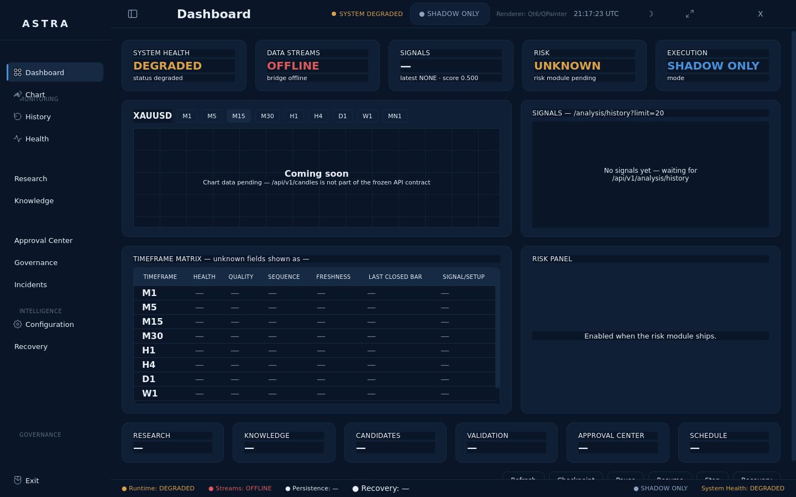
What it shows: the default landing page — five KPI cards, the chart
placeholder, the latest-signals panel, the timeframe matrix, the risk panel,
six quick cards and the bottom action bar.
Look at: KPI row hierarchy; the "Coming soon" chart placeholder; the
9-row timeframe matrix reading "—" on every unavailable field.

### dashboard_light.png
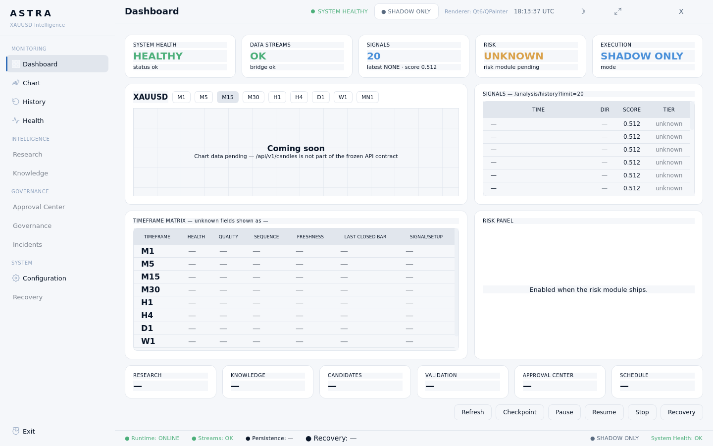
What it shows: the same dashboard on the light theme.
Look at: light surfaces via the palette (no residual dark cards); text
contrast; the SHADOW ONLY chip and the theme/fullscreen buttons top-right.

### chart_dark.png
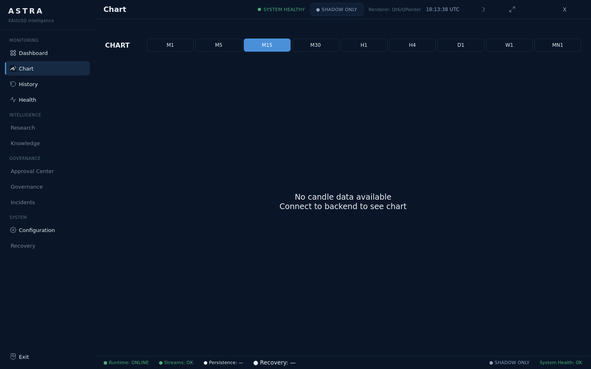
What it shows: the Chart page — timeframe switcher, price panel and the
CandleChart widget with no series data yet.
Look at: the honest empty state ("waiting for /api/v1/candles"); grid and
axis colours derived from the active palette.

### chart_light.png
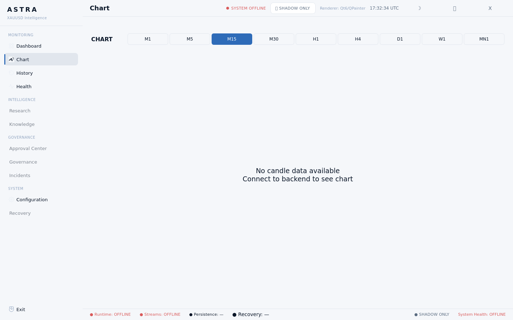
What it shows: the Chart page on the light theme.
Look at: the chart background is light and the grid lines are subtle.

### history_dark.png
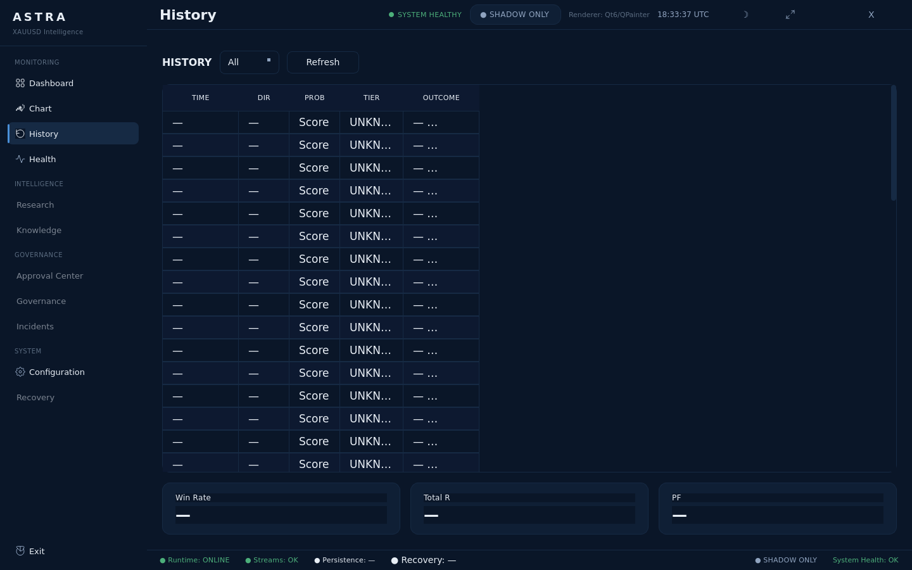
What it shows: the History page — the analysis-history table with empty
state until the backend returns rows.
Look at: table header treatment; row density; the empty-state copy.

### history_light.png
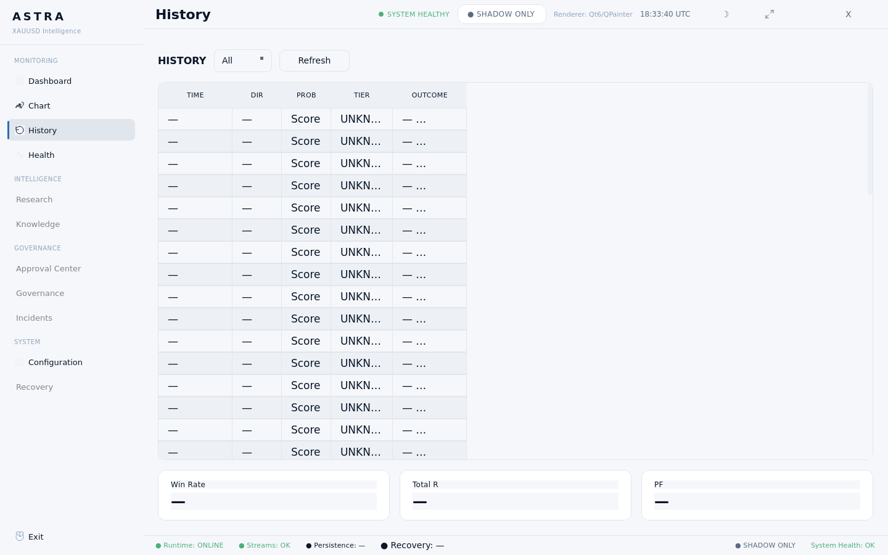
What it shows: the History page on the light theme.
Look at: alternating row tint and border contrast on light.

### health_dark.png
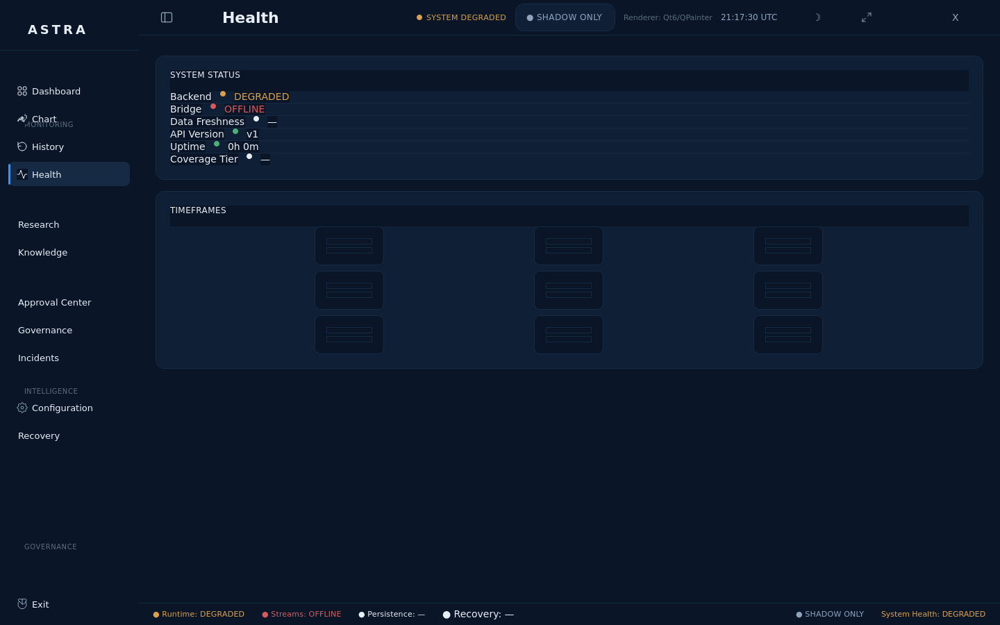
What it shows: the Health page — backend status, stream/persistence
readouts and freshness indicators sourced from `/api/v1/health`.
Look at: the semantic status dots (healthy / degraded / offline).

### health_light.png
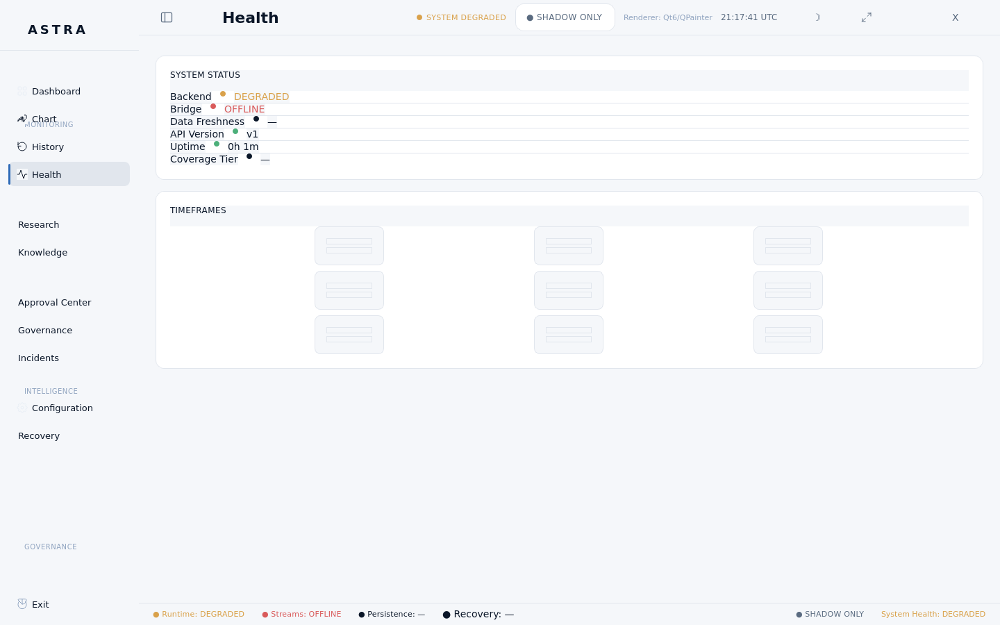
What it shows: the Health page on the light theme.
Look at: status-dot legibility and label/value separation.

### settings_dark.png
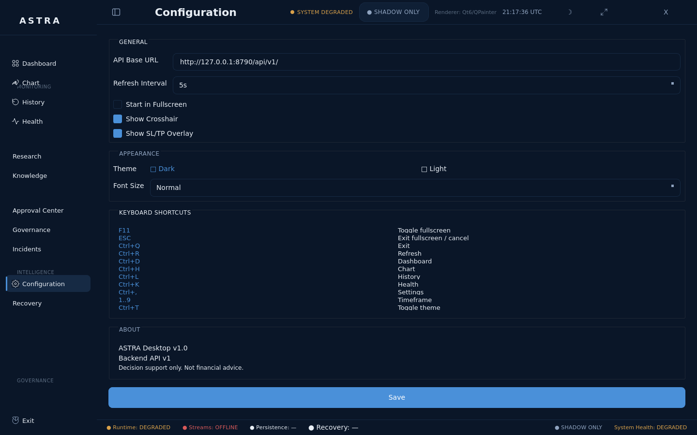
What it shows: the Configuration page — endpoint/base-URL fields, polling
intervals and theme controls.
Look at: form field styling and label alignment.

### settings_light.png
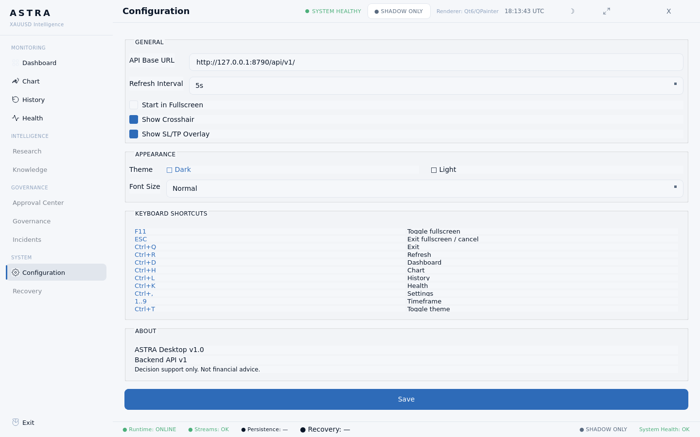
What it shows: the Configuration page on the light theme.
Look at: input borders and placeholder contrast on light.

### coming_soon_dark.png
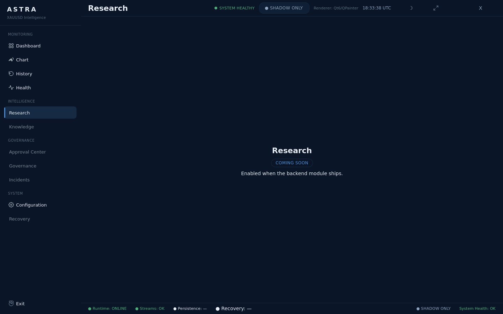
What it shows: the shared ComingSoonPage reached from Research, Knowledge,
Approval Center, Governance, Incidents and Recovery.
Look at: the honest "module not yet available" messaging — no fake data.

### coming_soon_light.png
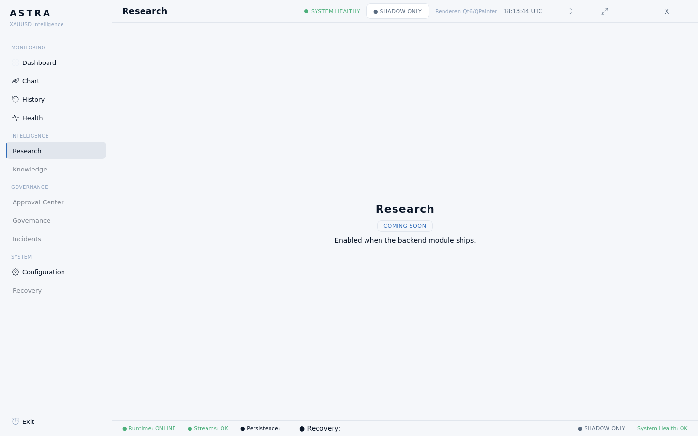
What it shows: the shared ComingSoonPage on the light theme.
Look at: consistency of the empty-state treatment with the dark theme.

### fullscreen_dark.png
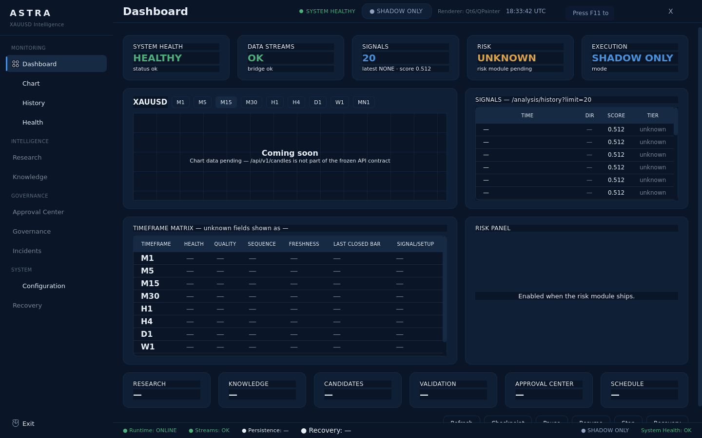
What it shows: F11 fullscreen mode. OS window chrome is removed; sidebar,
top bar and bottom bar all remain visible.
Look at: nothing is hidden in fullscreen; the layout reflows to 1440×900.

## Real vs placeholder

Real:
- Shell: sidebar, top bar, bottom bar, grouped nav
- Theme system: dark + light, both palette-driven
- Live header clock, `/health` status badge
- Timeframe matrix (9 rows)

Placeholder:
- Chart page: needs `/api/v1/candles` (not in the frozen API)
- Risk panel: backend risk module pending
- Research / Knowledge / Approval Center / Governance / Incidents /
  Recovery: coming soon

## How to build and run

See `frontend/qt/README.md`. The Windows `.exe` is produced by CI and
uploaded as the artifact `ASTRA-windows`.

## Requested review

Please confirm:
1. Does the layout match the reference?
2. Is anything missing?
3. Any color / spacing adjustments?
4. Should the chart placeholder be more prominent?
